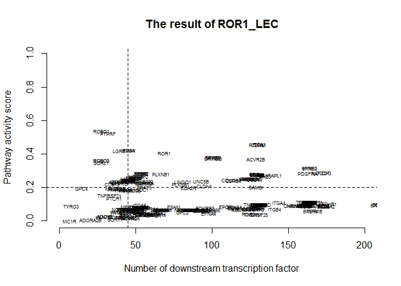

SPAGI
================
Md Humayun Kabir

<!-- README.md is generated from README.Rmd -->
SPAGI: Identification of active signalling pathways by integrating gene expression and protein interaction network
==================================================================================================================

Introduction
------------

This file contains the R code to run an example workflow for active pathway identification of ocular lens epithelial cell (LEC) RNA-seq gene expression data using the *SPAGI* package. This LEC data was generated by differentiating from human pluripotent stem cells. The package can help to identify the active signalling pathways based on gene expression profile by using pre-built background pathway path data. To create the background pathway path data first we have utilized the PPI data from STRINGdb for the molecules, then applied graph shortest path algorithm to get the pathway paths and finally filtered out the paths where all molecules are housekeeping genes. You can look at the *generate\_pathway\_path* file to get the necessary instruction and R code of utilizing the *SPAGI* helping functions to generate the background pathway path data. We have generated the list of housekeeping genes based on gene expression profile of a large number of cell types or tissues obtained from the ENCODE project.

All the necessary data to run the example workflow are deposited in the *SPAGI* github repository <https://github.com/VCCRI/SPAGI/tree/master/data>. These data are automatically loaded with the package. This may take some time during installation.

Please note that the query RNA-seq gene expression data should be in RPKM/FPKM/CPM and log normalized form. Also the gene ids must be official gene symbols as our background data sets are oficial gene symbols. The package assumes that all the query RNA-seq data are in normalized form and the gene ids are official gene symbols. Also you need an expression cutoff threshold and high expression threshold (generally a value &gt; expression value of the peak of distribution) for your query RNA-seq gene expression data. Finally, the gene expression data must be in matrix format with replicated column headers per-replicate for each cell type or tissue.

Installation
------------

*SPAGI* depends on one package *data.table*. To generate the background pathway path data it relies on packages *STRINGdb* and *igraph*. Make sure you have installed all the packages. The commands to do so are as follows:

Open an R session and do the following:

``` r
source("http://bioconductor.org/biocLite.R")
biocLite("STRINGdb")

install.packages('data.table')
install.packages('igraph')
```

Make sure you have *devtools* installed, then install the *SPAGI* package from github repository:

``` r
install.packages('devtools')
devtools::install_github('VCCRI/SPAGI')
```

Finally load the packages with:

``` r
library(data.table)
#> Warning: package 'data.table' was built under R version 3.3.3
library(spagi)
```

Package installation and loading is done!

You are now ready to run the example.

You can run the entire following example using:

``` r
example(spagi)
```

Example
-------

In this example workflow we will use *pathway.path* as background data from the *SPAGI* repository. Also we will use *ROR1.data* as query RNA-seq LEC gene expression data ([PMC:5825866](https://www.ncbi.nlm.nih.gov/pmc/articles/PMC5825866/)). The *ROR1.data* has two biological replicates. We have already made the query data in CPM and log2 normalized form. Also we have made the column names of the replicates identical as these are from same cell type. These data sets are loaded automatically with the package.

### Pre-process the query data

The query data is already in CPM and log2 normalized form. Here, we will use the expression cutoff as 1.8 of the query data.

``` r
ROR1.processed.data<-preprocess_querydata(cell.tissue.data = ROR1.data, exp.cutoff.th = 1.8)
```

### Identify active pathway paths of the processed query data

Here we will use the background *pathway.path* data to get the active pathway paths of the processed query data.

``` r
ROR1.active.pathway<-identify_active_pathway_path(pathway.path = pathway.path, processed.query.data = ROR1.processed.data)
```

### To save the active pathway paths in csv format

After getting the active pathway paths, you can save the data in csv file format where each row will denote a path and all the paths starting from the same source comprises of a pathway of the source protein.

``` r
lapply(unlist(ROR1.active.pathway$query_data, recursive = F, use.names = F), write, "ROR1.active.pathway.csv", append=T, ncolumns=10)
```

### Get active pathway ranking metric (i.e., activity score and number of downstream transcription factors)

Here we will use the *ROR1.active.pathway* and *ROR1.processed.data* data sets to get the acitve pathway ranking metric. Also we will use a high expression threshold (here we will use 7) for the processed query data.

``` r
ROR1.active.pathway.ranking.metric<-get_pathway_ranking_metric(active.pathway.path = ROR1.active.pathway, processed.query.data = ROR1.processed.data, high.exp.th = 7)
```

### Plot the ranking metric result in a 2D plane

After getting the active pathway ranking metric result you can display them in your preferred format. Here we will plot them in a 2D plane where x-axis denotes the number of downstream transcription factors and y-axis denotes the activity score for each pathway.

``` r
display_pathway_ranking_metric(pathway.ranking.metric = ROR1.active.pathway.ranking.metric)
#> [1] "ROR1_LEC -- result plotting done!!"
#To separate the top ranked pathways we can do this
abline(v=45, h=0.2, lty=2, col="black")
```



### That's it! Now perform your own analyses using the *SPAGI* package.
